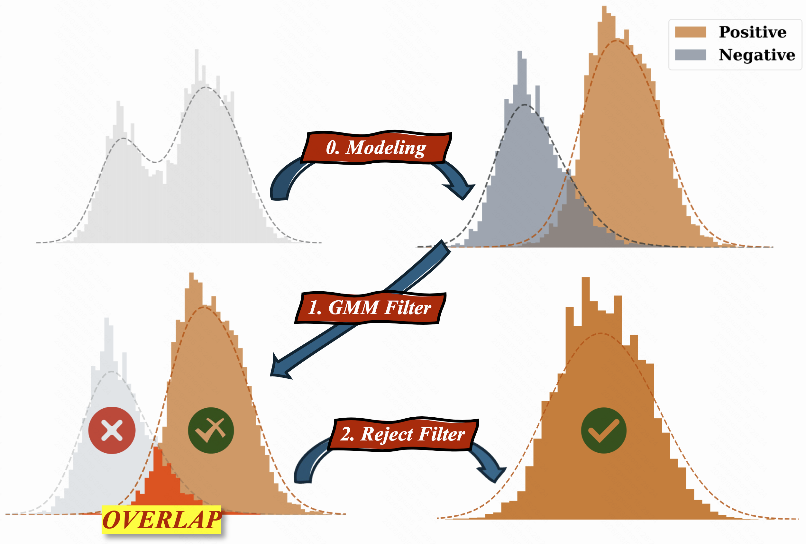

<h2 align="center">
  Believe Your Model: Distribution-Guided Confidence Calibration
</h2>

<p align="center">
  <a href="https://arxiv.org/abs/2603.03872">
    
  <a href="https://github.com/yxizhong/SSC">
    
  </a>

  
</p>

## 📊 Overview
<p align="center">
  
</p>

- We introduce ***DistriVoting***, a test-time scaling framework that exploits the distributional characteristics of model confidence to improve answer selection. By applying Gaussian Mixture Models, ***DistriVoting*** separates confidence scores into distinct positive and negative distributions, then employs a rejection mechanism to filter out ambiguous candidates. We further present ***SelfStepConf***, a dynamic inference strategy that leverages step-level confidence to widen the gap between high-quality and low-quality responses, thereby strengthening the reliability of the voting process.
- Experimental results spanning 16 models and 5 benchmarks show that ***DistriVoting*** delivers substantial performance gains over existing test-time scaling methods. Notably, our approach achieves these improvements through better utilization of internal model signals, without depending on external verifiers or additional training overhead.
- The ***SelfStepConf*** mechanism proves particularly effective in enhancing distribution separation during inference. By adaptively controlling the reasoning process based on step-level confidence, it not only boosts overall accuracy but also makes confidence scores more discriminative, leading to more reliable answer selection in the voting stage.


## 🚀 Quick Start

### ⚙️ Environment Setup

**Step 1: Clone the repository**

```bash
git clone https://github.com/yxizhong/SSC.git
cd SSC
```

**Step 2: Create a conda environment**

```bash
conda create -n SSC python==3.11.13
conda activate SSC
```

**Step 3: Install dependencies**

```bash
pip install -r requirements.txt
```


### 🏋️ SelfStepConf/Basic Inference


```bash
# SelfStepConf
bash scripts/ssc/run_ssc_snapshot.sh

# Basic
bash scripts/ssc/run_baseline_snapshot.sh
```

> 💡 **Tip:** The output content during the generation process will be saved in the "output dir" specified in the sh file, which is necessary for the subsequent voting process.

### 📈 Voting

```bash
# Run evaluation on benchmarks
python scripts/distri_voting.py
```


## Citation
If you find our work helpful, please consider citing:
```
@misc{yang2026believemodeldistributionguidedconfidence,
      title={Believe Your Model: Distribution-Guided Confidence Calibration}, 
      author={Xizhong Yang and Haotian Zhang and Huiming Wang and Mofei Song},
      year={2026},
      eprint={2603.03872},
      archivePrefix={arXiv},
      primaryClass={cs.LG},
      url={https://arxiv.org/abs/2603.03872}, 
}
```
